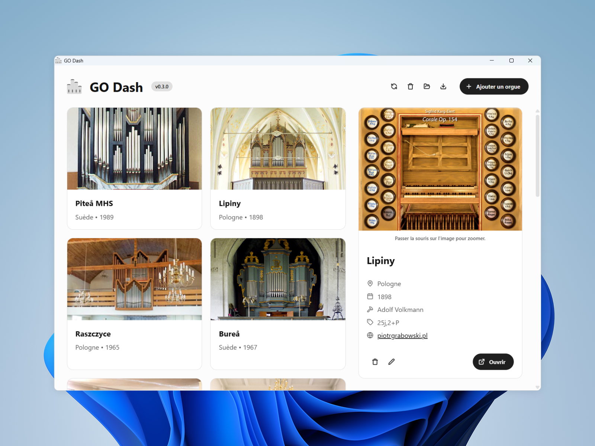

_An app to easily manage your [GrandOrgue](https://github.com/GrandOrgue/grandorgue) organ library._

### Features

- Add, edit or remove an organ and write information about it: 
    - name
    - country
    - year of construction
    - builder
    - other specifications
    - URL of an associated website
    - organ file (.orgue, .organ)
    - cover image
    - console preview image
- Launch the associated GrandOrgue file directly from the GO Dash app
- Import and export your config file
- Nice and modern UI

⚠️ __Only Windows is supported for now, and the application is displayed in French only.__

### Download

Download the [latest version](https://github.com/devmlb/go-dash/releases/latest) from the releases section.

## Project setup for development

GO Dash is based on [electron-vite](https://electron-vite.org/).

### Install and test

```bash
# Install dependencies
$ npm i

# Launch live development server
$ npm run dev
```

### Build

```bash
# For windows
$ npm run build:win

# For macOS
$ npm run build:mac

# For Linux
$ npm run build:linux
```
