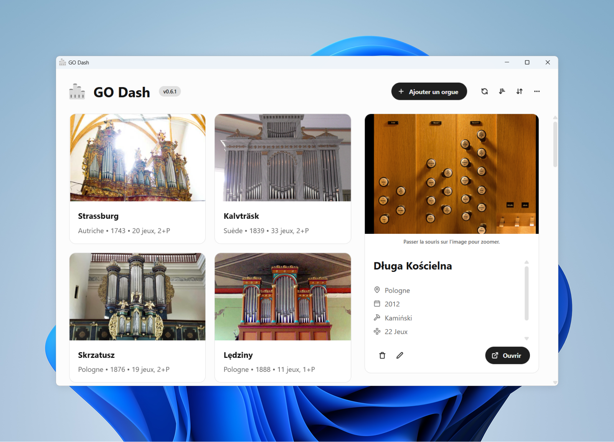

_An app to easily manage your [GrandOrgue](https://github.com/GrandOrgue/grandorgue) organ library._

### Features

- Add, edit or remove an organ and write information about it: 
    - name
    - country
    - year of construction
    - builder
    - stops number
    - keyboards number and pedals
    - other features
    - URL of an associated website
    - organ file (.orgue, .organ)
    - cover image
    - console preview image
- Sort your organs by name, country, year of construction, builder, stops number or keyboards number
- Launch the associated GrandOrgue file directly from the GO Dash app
- Import and export your config file
- Nice and modern UI

### Download

Download the [latest version](https://github.com/devmlb/go-dash/releases/latest) from the releases section.

> ⚠️ Please note that only the Windows x64 build is fully tested for now.

> ⚠️ To open MacOS builds, you will need to [whitelist the installation in your Privacy & Security settings](https://support.apple.com/fr-fr/guide/mac-help/mh40616/mac).

## Project setup for development

GO Dash is based on [Tauri](https://v2.tauri.app/), an open-source framework used to build tiny, fast, and cross-platform applications using web technologies for the user interface and Rust for the backend logic.

### Install and test

```bash
# Install dependencies
npm i

# Launch in development mode (with hot reload)
npm run tauri dev
```

### Build

The build output will depend on your host OS.

```bash
npm run tauri build
```
